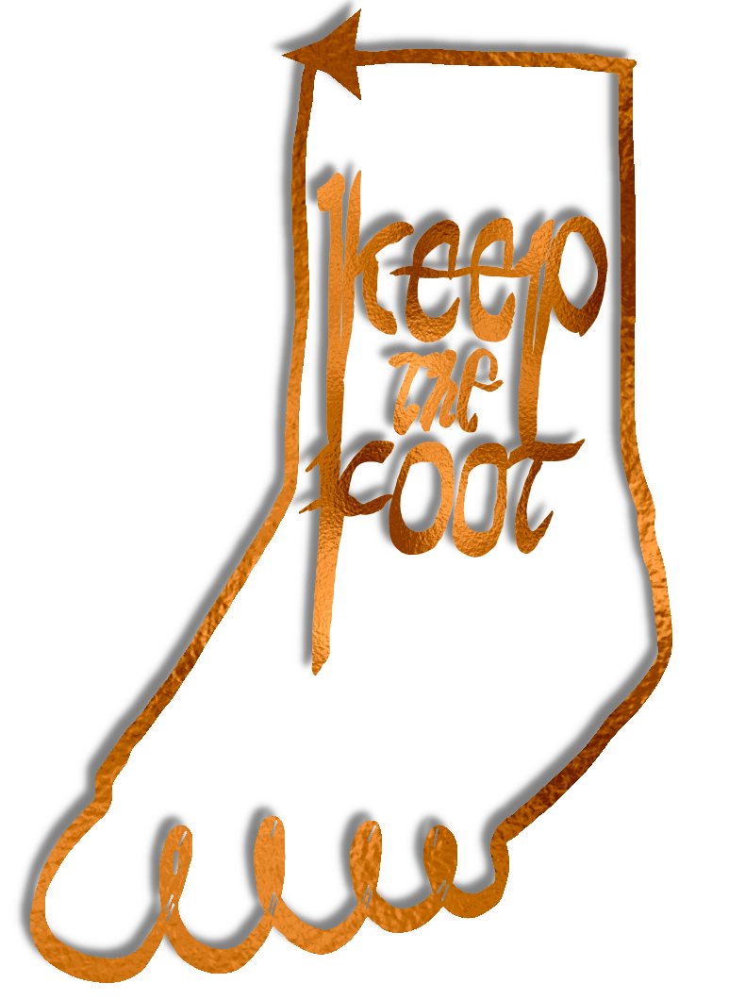

<section class="home-hero-text">
  

    Developing cost&#x2011;effective strategies to prevent leg&nbsp;amputations.
  

</section>

    

<nav class="home-sections" aria-label="Homepage sections">
  <h2><a href="/Tutorials/">Tutorials</a></h2>
  <h2><a href="/Works/">Works</a></h2>
  <h2><a href="/System/">System of Care</a></h2>
  <h2><a href="/Brochure/">Brochure</a></h2>
  <h2><a href="/About/">About</a></h2>
</nav>

  <figure class="home-index-image">
    
  </figure>
  </section>
